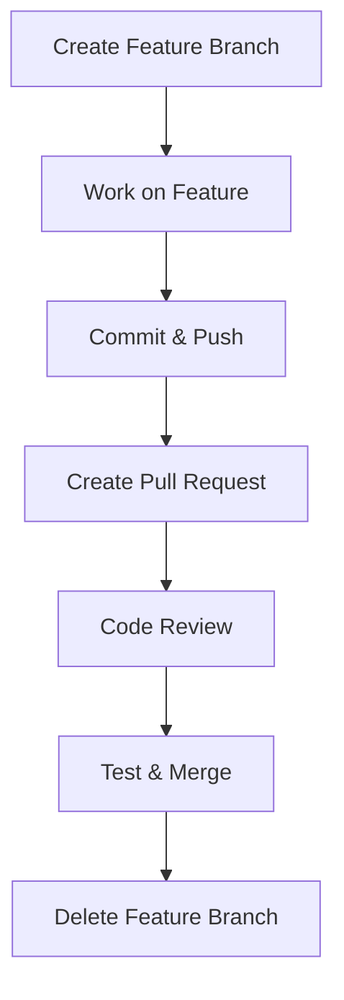

# Feature Branch Workflow Documentation

---

### Author Information

| **Author**   | **Created on** | **Version** | **Last updated by** | **Last edited on** | **Level** | **Reviewer**  |
|--------------|----------------|-------------|---------------------|--------------------|-----------|---------------|
| Ishaan    | 30-07-25    | v1.0  |  Ishaan  |30-07-25   | Internal    | Rohit Chopra    | 

---

## Table of Contents

1. [Introduction](#1-introduction)  
2. [Why Feature Branch Workflow?](#2-why-feature-branch-workflow)  
3. [Workflow Diagram](#3-workflow-diagram)  
4. [Advantages](#4-advantages)  
5. [Disadvantages](#5-disadvantages)  
6. [Conclusion](#6-conclusion)  
7. [Contact Information](#7-contact-information)  
8. [References](#8-references)

---

## 1. Introduction

This document provides a structured overview of the Feature Branch Workflow — a Git-based development strategy used for managing code changes in a collaborative environment

---

## 2. Why Feature Branch Workflow?

The **Feature Branch Workflow** is a Git-based development strategy where each new feature is developed in its own branch, isolated from the `main` or `production` codebase. It allows developers to work independently without interfering with the stable codebase.
Feature branching provides a clean way to manage different streams of development while maintaining a stable main branch. It encourages collaboration and code reviews through pull requests and ensures features are tested before they’re merged.

---

## 3. Workflow Diagram

---

## 4. Advantages

| Benefit                  | Description                                                   |
| ------------------------ | ------------------------------------------------------------- |
| **Isolation of Work**    | Each feature is developed in a separate branch, keeping experimental or incomplete code away from the stable main branch. |
| **Code Review Friendly** |Changes are submitted through pull requests, allowing peer review and feedback before merging into the main branch.               |
| **Easy Revert**         | If something goes wrong, it’s easy to roll back or discard a feature branch without affecting the rest of the project.               |
| **CI/CD Friendly**       | Feature branches can be tested independently using automated pipelines before being merged, reducing bugs in production             |

---

## 5. Disadvantages

| **Disadvantage** | Description | 
| ---------------------------- | ------------------------------------------------------------------------------ |
| **Merge Conflicts** |   If feature branches diverge too much from the main branch, merging them can lead to conflicts that are hard to resolve.  |  
| **Feedback delay** | It might take too long for the changes to be merged into the main branch. |
| **Delayed Integration** | Features are not tested in the main codebase until after merging, which can delay the discovery of integration issues. |
| **Complex Dependency Handling** | When features depend on each other across branches, developers may need to frequently rebase or create temporary fixes |

---
## 6. Conclusion

**Feature Branch Workflow** is ideal for teams that require structured collaboration, isolated development, and robust code review pipelines. It provides a scalable model for both small and large teams.

However, to prevent issues like merge conflicts and branch divergence, it’s important to **merge frequently** and **keep branches short-lived**.

---
## 7. Contact Information

| Name| Email Address      | GitHub | URL |
|-----|--------------------------|-------------|---------|
| Ishaan | ishaan.aggarwal.snaatak@mygurukulam.co|  Ishaan-Dev1  |   https://github.com/Ishaan-Dev1  |

---
## 8. References

| Resource Name   | Link                                                                                                           |
| --------------- | -------------------------------------------------------------------------------------------------------------- |
| Feature Branch Workflow | [Feature Branch Workflow](https://www.atlassian.com/git/tutorials/comparing-workflows/feature-branch-workflow) |

---

