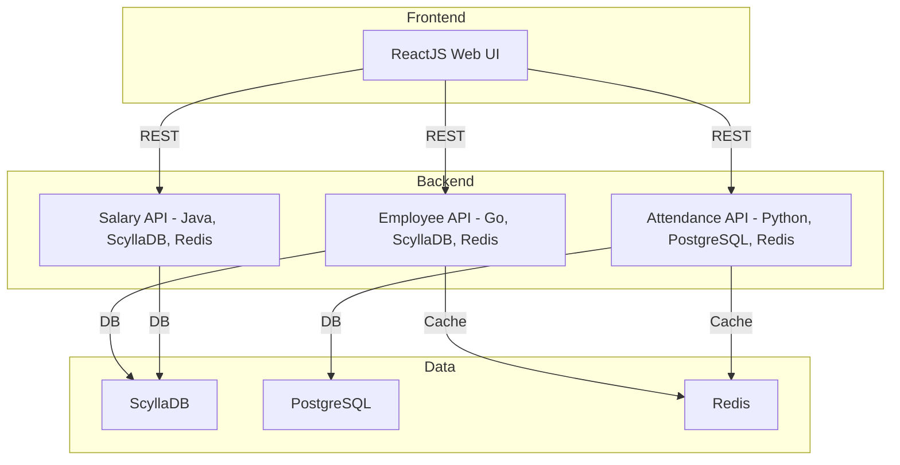
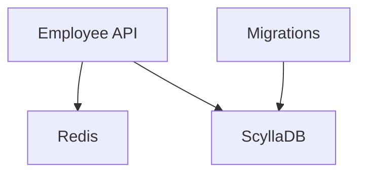
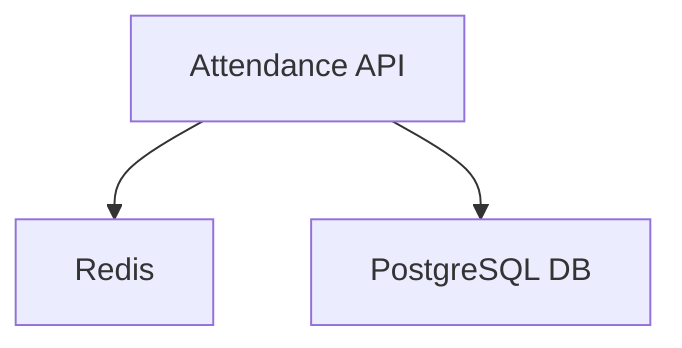
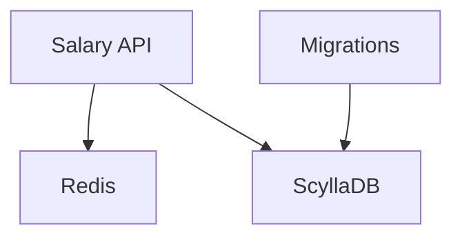
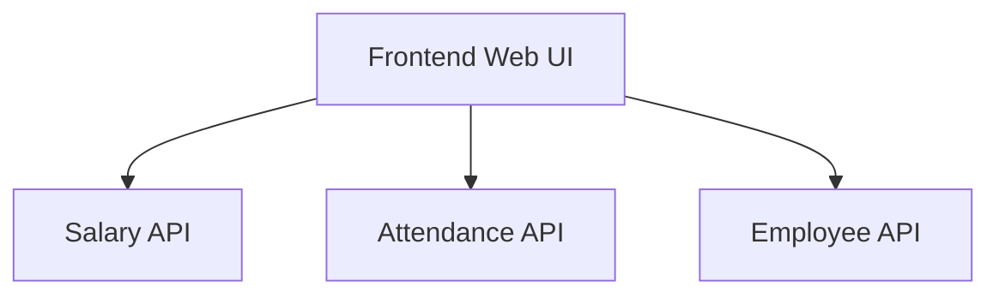

# Full Stack Document 

---

### Author Information

| **Author**   | **Created on** | **Version** | **Last updated by** | **Last edited on** | **Level** | **Reviewer**  |
|--------------|----------------|-------------|---------------------|--------------------|-----------|---------------|
| Ishaan    | 5-08-25    | v1.0  |  Ishaan  |5-08-25   | Internal    | Rohit Chopra    | 

---

## Table of Contents

1. [Introduction](#1-introduction)
2. [Purpose](#2-Purpose) 
3. [Pre-requisites ](#3-Pre-requisites)
4. [ System Requirements](#4-System-Requirements)
5. [Dependencies](#5-Dependencies)  
6. [Ports](#6-Ports)
7. [Architecture](#7-Architecture)  
8. [API Setup and Execution](#8-API-Setup-and-Execution)  
9. [Troubleshooting](#9-Troubleshooting)
10. [FAQs](#10-faqs)
11. [Conclusion](11-conclusion)  
12. [Contact Information](#12-contact-information) 
13. [References](#13-References)

---

# 1. Introduction

---

# 2. Purpose

---

# 3. Pre-requisites

The Full Stack API application has dependencies on other REST APIs from **[OT-Microservices](https://github.com/OT-MICROSERVICES)**. To run the application successfully, ensure the following APIs are configured and running:

* **[Employee API](https://github.com/Snaatak-Apt-Get-Swag/documentation/blob/SCRUM-73-kawalpreet/OT-Microservices/Applications/Employee-API/Introduction/README.md)**
* **[Attendance API](https://github.com/Snaatak-Apt-Get-Swag/documentation/blob/SCRUM-71-mansoor/OT-Microservices/Applications/Attendance-API/Introduction/README.md)**
* **[Salary API](https://github.com/Snaatak-Apt-Get-Swag/documentation/blob/SCRUM-75-mansoor/OT-Microservices/Applications/Salary-API/Introduction/README.md)**
* **[Frontend API](https://github.com/Snaatak-Apt-Get-Swag/documentation/blob/scrum-77-sunny/OT-Microservices/Frontend-api/Introduction/README.md)**

---

# 4. System Requirements

| Requirement   | Details                      |
|---------------|-----------------------------|
| **OS**        | Ubuntu or other Linux-based OS |
| **RAM**       | 4 GB minimum                |
| **Disk Space**| 40 GB                       |
| **Processor** | Dual-core recommended       |
| **Instance**  | t2.large                    |

---

# 5. Dependencies
### A. **Build-Time Tools**

| **Tool**  | **Version** | **Used For**                            |
| --------- | ----------- | --------------------------------------- |
| Python    | 3.11+       | `attendance-api`, `notification-worker` |
| Go        | 1.20+       | `employee-api`                          |
| Java      | 17+         | `salary-api`                            |
| pip / npm | Latest      | Python & React dependencies             |

### B. **Runtime Dependencies**

| **Service**           | **Libraries/Tools Used**       |
| --------------------- | ------------------------------ |
| `employee-api`        | Go Redis client, Scylla driver |
| `attendance-api`      | Flask, psycopg2, Redis         |
| `salary-api`          | Spring Boot, JPA, MySQL/ES     |
| `notification-worker` | Redis Queue, smtplib           |
| `frontend`            | React, Axios, Traefik          |

---
# 6. Ports

| Port  | Protocol/Service  | Description                                         |
|-------|-------------------|-----------------------------------------------------|
| 8080  | HTTP (Swagger UI) | Access Swagger UI for API documentation             |
| 9042  | ScyllaDB          | Default port for ScyllaDB NoSQL database            |
| 6379  | Redis             | Default port for Redis cache                        |
| 80    | HTTP              | Standard web traffic                                |
| 443   | HTTPS             | Secure web traffic                                  |
|||

---

# 7. Architecture

---

# 8. API Setup and Execution

## Setup Backend and Frontend API

#### 1. Employee API 

To setup Employee API [Configure Employee API](https://github.com/Snaatak-Apt-Get-Swag/documentation/blob/SCRUM-72-sachin/OT-Microservices/Applications/Employee-api/POC/README.md)

#### 2. Attendance API

To setup Attendance API [Configure Attendance API](https://github.com/Snaatak-Apt-Get-Swag/documentation/blob/12db0585666ba06c440dd3f49d5346fa6c342599/OT-Microservices/Application/Attendance-API/POC/README.md)

#### 3. Salary API

To setup Salary API [Configure Salary API](https://github.com/Snaatak-Apt-Get-Swag/documentation/blob/SCRUM-74-sharik/OT-Microservices/Applications/Salary-API/POC/README.md)

#### 4. Frontend

To setup Frontend [Configure Frontend API](https://github.com/Snaatak-Apt-Get-Swag/documentation/blob/SCRUM-76-ishaan/OT-Microservices/Applications/Frontend-API/POC/README.md)

#### 5. Notification Worker

To setup Notification Worker Notification Worker [Configure Notification Worker](https://github.com/Snaatak-Apt-Get-Swag/documentation/blob/scrum-66-sunny/OT-Microservices/Application/Notification/POC/README.md)

---

## 9. Troubleshooting

| **Issue**              | **Solution**                                              |
| ---------------------- | --------------------------------------------------------- |
| Redis not connecting   | Ensure Redis is running and accessible on port 6379       |
| DB connection fails    | Validate `.env` credentials and check firewall            |
| API not responding     | Ensure all services are running and healthy               |
| SMTP errors            | Check email credentials, SMTP port, and service status    |
| CORS / frontend issues | Validate proxy setup via Traefik and update CORS policies |

---

## 10. FAQs

#### 1. Is this application free?
Yes, OT-Microservices is open-source.

#### 2. Can I deploy this application on all Cloud platforms?
Yes, it is cloud-agnostic and can run anywhere Docker is supported.

#### 3. Do you offer an enterprise version of this application?
No, only the open-source version is available

---

## 11. Conclusion

This full-stack enables robust attendance tracking, salary computation, and employee management through modular microservices. Its scalable design allows independent development and deployment of services while maintaining performance and observability. Redis and databases serve as the backbone for service communication and data persistence.

---

## 12. Contact Information

| Name| Email Address      | GitHub | URL |
|-----|--------------------------|-------------|---------|
| Ishaan | ishaan.aggarwal.snaatak@mygurukulam.co|  Ishaan-Dev1  |   https://github.com/Ishaan-Dev1  |

---

## 13. References

| Resource                         |  Link                                                                 |
|--------------------------------|--------------------------------------------------------------------------------|
|  | |
|   | |
