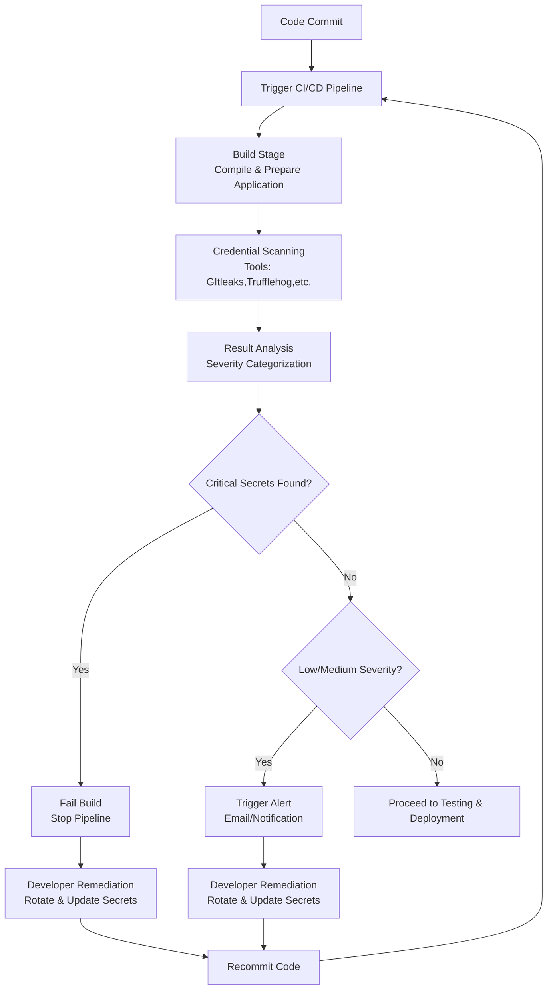

# Cred Scanning

---

### Author Information

| **Author**   | **Created on** | **Version** | **Last updated by** | **Last edited on** | **Level** | **Reviewer**  |
|--------------|----------------|-------------|---------------------|--------------------|-----------|---------------|
| Ishaan    | 11-08-25    | v1.0  |  Ishaan  |12-08-25   | Internal    | Rohit Chopra    | 

---

## Table of Contents

1. [Introduction](#1-introduction)  
2. [What are AWS Cost Allocation Tags?](#2-what-are-aws-cost-allocation-tags)  
3. [Why Use Cost Allocation Tags?](#3-why-use-cost-allocation-tags)  
4. [Workflow Diagram](#4-workflow-diagram)  
5. [Advantages](#5-advantages)  
6. [Best Practices](#6-best-practices)  
7. [Conclusion](#7-conclusion)  
8. [FAQs](#8-faqs)  
9. [Contact Information](#9-contact-information)  
10. [References](#10-references)

---

## 1. Introduction

---

## 2. What is  Credential Scanning?

Credential scanning in continuous integration (CI) involves automatically inspecting code and configuration files for hardcoded secrets, such as passwords, API keys, and other sensitive information, to prevent them from being exposed in production environments

---

## 3. Why need Credential Scanning?

| Benefit | Description |
|---------|-------------|
| **Prevent Data Breaches** | Secrets like API keys, database passwords, and access tokens can grant attackers unauthorized access if exposed. Credential scanning identifies and removes them before exploitation. |
| **Reduces the Attack Surface** | Minimizing exposed secrets lowers the potential entry points for malicious actors. |
| **Early Detection** | Stops secrets from leaving the developer's local environment. |
| **Automates Security Checks** | Integrates into CI pipelines to ensure consistent and regular scanning for vulnerabilities. |
| **Improves Security Posture** | Proactively addresses secret exposures to build secure applications and infrastructure. |
| **Compliance** | Supports adherence to security standards like GDPR, HIPAA, and PCI-DSS. |

---

## 4. Workflow Diagram

---
## 5. Different Tools

| Tool | Description | Key Features | Integrations | Pricing |
|------|-------------|--------------|--------------|---------|
| **TruffleHog** | Scans for high entropy strings and secrets in code, Git history, cloud storage, and Docker images. | Regex + entropy detection, deep history scan, multi-source scanning | GitHub, GitLab, Bitbucket, S3, local FS, Docker | Open-source |
| **Gitleaks** | Lightweight secret scanner for Git repos. | Fast, customizable regex rules, history scanning | GitHub Actions, GitLab CI, Jenkins | Open-source |
| **GitHub Secret Scanning** | Native GitHub feature for private/public repos. | Real-time scanning, partner patterns | GitHub only | Built-in for Enterprise |
| **Detect Secrets** | Yelp’s Python-based secret scanner. | Baseline file, plugin-based detection | CI/CD pipelines, pre-commit | Open-source |
| **GitGuardian** | SaaS secret detection & monitoring. | Dashboard, real-time alerts, remediation help | GitHub, GitLab, Bitbucket | Paid with free tier |

---

## 5. Advantages

| Advantage                    | Description                                                                 |
|-----------------------------|-----------------------------------------------------------------------------|
| Early Detection             | Catches exposed secrets before they reach production or public repos.       |
| Automated Enforcement       | Scans every commit/build automatically—no manual effort needed.             |
| Developer Feedback Loop     | Alerts developers instantly during CI runs for quick remediation.           |
| Reduced Breach Risk         | Prevents leaks of sensitive data like API keys, tokens, and passwords.      |
| Easy CI Integration         | Works smoothly with CI tools like GitHub Actions, GitLab CI, and Jenkins.   |
---

## 6.  Best Practices

| Best Practice                        | Description                                                                 |
|-------------------------------------|-----------------------------------------------------------------------------|
| **Tag Early and Consistently**      | Apply tags at launch time using IaC, Lambda, or policies                   |
| **Standardize Tag Keys**            | Use consistent formats (e.g., `Environment`, `Owner`, `CostCenter`)        |
| **Use Automation**                  | Enforce tags with AWS Config, Service Control Policies, or Lambda functions |
| **Regular Audits**                  | Periodically verify tag coverage with AWS Tag Editor and reports           |
| **Limit Number of Tags**            | Keep tag keys manageable to avoid confusion                                |

---

## 7. Conclusion

Cost Allocation Tags are **vital tools** for managing and optimizing your AWS costs. When implemented correctly, they enable **full visibility, accountability, and control** over cloud spending. Integrating them into your infrastructure strategy ensures a cost-effective and transparent AWS environment.

---

## 8. Frequently Asked Questions (FAQs)

### 1. **Do I need to pay to use Cost Allocation Tags?**
No, AWS does not charge for tagging or viewing cost allocation tags.

### 2. **Are tags automatically applied to all resources?**
No, you must apply tags manually or automate them using tools like AWS Lambda, IaC, or SCPs.

### 3. **How long does it take for tags to show in Cost Explorer?**
Tags typically appear in Cost Explorer within 24 hours after being activated.

### 4. **Can I modify tags after a resource is created?**
Yes, tags can be edited anytime through the AWS Console, CLI, or SDKs.

### 5. **What is the maximum number of tags per resource?**
AWS allows up to 50 tags per resource, including both user-defined and AWS-generated tags.

---

## 9. Contact Information

| Name| Email Address      | GitHub | URL |
|-----|--------------------------|-------------|---------|
| Ishaan | ishaan.aggarwal.snaatak@mygurukulam.co|  Ishaan-Dev1  |   https://github.com/Ishaan-Dev1  |

---

## 10. References

| Resource | Link |
|----------|------|
| AWS Official Documentation – Cost Allocation Tags | [Link](https://docs.aws.amazon.com/awsaccountbilling/latest/aboutv2/cost-alloc-tags.html) |
| AWS Tagging Best Practices | [Link](https://docs.aws.amazon.com/general/latest/gr/aws_tagging.html) |
| AWS Billing and Cost Management User Guide | [Link](https://docs.aws.amazon.com/awsaccountbilling/latest/aboutv2/billing-what-is.html) |
| AWS Cost Explorer | [Link](https://docs.aws.amazon.com/cost-management/latest/userguide/what-is-cost-explorer.html) |

