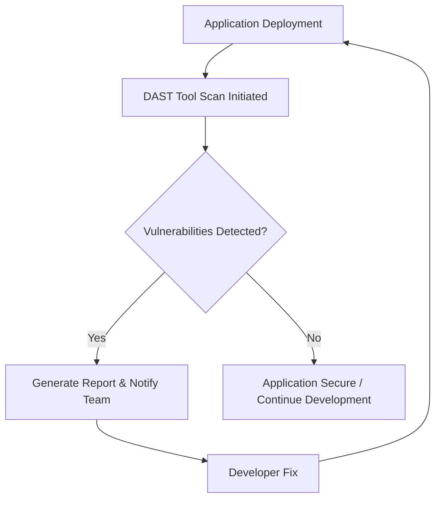

# GO DAST

---

## Author Information

| **Author**   | **Created on** | **Version** | **Last updated by** | **Last edited on** | **Level** | **Reviewer**  |
|--------------|----------------|-------------|---------------------|--------------------|-----------|---------------|
| Ishaan    | 17-08-25    | v1.0  |  Ishaan  |17-08-25   | Internal    | Rohit Chopra    | 
| Ishaan    |     |   |  Ishaan  |   | L0    |     | 
| Ishaan    |     | v1.0  |  Ishaan  |15-08-25   | L1    |     | 
| Ishaan    |     | v1.0  |  Ishaan  |15-08-25   | L2    |    | 

---

## Table of Contents

1. [Introduction](#1-introduction)  
2. [What is Dynamic Application Security Testing (DAST)?](#2-what-is-dynamic-application-security-testing-dast)  
3. [Why Need DAST?](#3-why-need-dast)  
4. [Workflow](#4-workflow)  
5. [Different Tools](#5-different-tools)  
6. [Comparison](#6-comparison)  
7. [Advantages](#7-advantages)  
8. [Disadvantages](#8-disadvantages)  
9. [Proof of Concept (POC)](#9-proof-of-concept-poc)  
10. [Best Practices](#10-best-practices)  
11. [Conclusion](#11-conclusion)  
12. [Frequently Asked Questions (FAQs)](#12-frequently-asked-questions-faqs)  
13. [Contact Information](#13-contact-information)  
14. [References](#14-references)  

---

## 1. Introduction

This document provides a comprehensive overview of **Dynamic Application Security Testing (DAST)**, focusing on its purpose, workflow, tools, and best practices for web applications

---

## 2. What is Dynamic Application Security Testing (DAST)?
Dynamic Application Security Testing (DAST) is a method of testing web applications for security vulnerabilities by simulating real-world attacks on a running application. It analyzes the application from an "outside-in" perspective, much like a malicious hacker would, without needing access to the application's source code.

---

## 3. Why need DAST?

Dynamic Application Security Testing (DAST) is crucial because it identifies real-world vulnerabilities in running applications, which could be exploited by attackers, and it does so without needing access to the source code.

| **Reason**                               | **Explanation**                                                                 |
|------------------------------------------|---------------------------------------------------------------------------------|
| **Simulates real-world attacks**          | DAST tools mimic how attackers interact with a live app, finding vulnerabilities other methods may miss. |
| **Identifies runtime issues**             | Detects vulnerabilities that only appear when the application is running (e.g., session flaws, XSS). |
| **Reduces risk of breaches and data leaks** | Finds vulnerabilities early in SDLC to fix before exploitation, lowering breach and data leak risks. |
| **Verifies security of third-party apps** | Assesses the security of externally built/vendor applications without source code. |
| **Language-independent**                     | Works with apps written in any language since it interacts from the outside.     |

- Go’s static binaries may hide vulnerabilities until runtime—DAST helps uncover these real-world issues.
- Generate OpenAPI (Swagger) specs for Go apps with [swaggo/swag](https://github.com/swaggo/swag) or [go-swagger](https://github.com/go-swagger/go-swagger).
- Pass these specs to DAST tools for deep API testing.
---

## 4. Workflow 

---
## 5. Different Tools

| Tool           | Notes for Go Projects |
|----------------|----------------------|
| **OWASP ZAP**  | Free, supports REST APIs, Docker; can use OpenAPI specs from Go code (Swagger). |
| **Burp Suite** | Powerful, manual & automated; good for custom Go endpoints, supports API scanning. |
| **StackHawk**  | Dev-focused, CI/CD integration; built for modern apps, supports Go APIs via OpenAPI. |
| **Invicti**    | Commercial, accurate scanning, supports OAuth/JWT—useful for Go auth flows. |
| **Acunetix**   | Comprehensive, strong SPA/API scanning; works well with Go web servers. |
| **Detectify**  | SaaS, plug-and-play; good for public-facing Go sites. |
| **Probely**    | API-first, excellent for Go microservices and continuous testing. |
| **GitLab DAST**| CI/CD native, works with Dockerized Go apps, based on ZAP. |

---

## 6. Comparison

| Tool        | License         | SPA/API | Auth Support | CI/CD | Go Integration | Ease of Use   |
|-------------|-----------------|---------|--------------|-------|---------------|---------------|
| ZAP         | OSS/Free        | Yes     | Yes (script) | Good  | Docker, API   | Moderate      |
| Burp Suite  | Commercial      | Yes     | Yes          | Good  | Manual/API    | Advanced      |
| StackHawk   | Commercial      | Yes     | Yes          | Excellent | API, OIDC   | Easy          |
| Invicti     | Commercial      | Yes     | Yes          | Very Good | API         | Easy          |
| Acunetix    | Commercial      | Yes     | Yes          | Very Good | API         | Easy          |
| Detectify   | SaaS            | Yes     | Limited      | Very Good | Web         | Very Easy     |
| Probely     | SaaS            | Yes     | Yes          | Very Good | API         | Easy          |
| GitLab DAST | OSS w/GitLab    | Yes     | Yes (ZAP)    | Excellent | Docker      | Moderate      |

---

## 7. Advantages

| **Advantage**                | **Explanation** |
|-------------------------------|-----------------|
| **Real-World Testing**        | Simulates real attacker behavior against the running application, identifying exploitable vulnerabilities. |
| **No Source Code Needed**     | Works as a black-box test, making it useful even when source code is unavailable (e.g., third-party apps). |
| **Detects Runtime Issues**    | Finds vulnerabilities that only appear when the app is live, such as session handling flaws or misconfigurations. |
| **Broad Technology Coverage** | Language-agnostic; works with any application stack (Go, Java, React, Node, etc.) since it tests exposed interfaces. |
| **OWASP Top 10 Coverage**     | Detects common vulnerabilities like SQL Injection, XSS, CSRF, HTML Injection, and authentication flaws. |
| **CI/CD Integration**         | Many tools integrate seamlessly into DevOps pipelines, enabling continuous security testing. |
| **Compliance Support**        | Helps organizations meet industry standards and regulations like PCI-DSS, HIPAA, and GDPR. |
| **Cost-Effective**            | Automated scanning reduces reliance on manual penetration testing, saving time and resources. |
| **Third-Party Validation**    | Can test applications from vendors where internal teams don’t have source code access. |
| **Improves Security Posture** | Provides remediation guidance, helping organizations strengthen overall application security. |

---
## 8. Disadvantages

| **Disadvantage**              | **Explanation** |
|-------------------------------|-----------------|
| **Limited Code Insight**       | Cannot see the source code, so it may miss hidden vulnerabilities not exposed at runtime. |
| **False Positives/Negatives**  | May report issues that don’t exist (false positives) or miss real vulnerabilities (false negatives) depending on configuration and coverage. |
| **Requires Running App**       | Needs a deployed/staging environment to test, unlike SAST which can run on code before deployment. |
| **Authentication Complexity**  | Handling logins, sessions, and OAuth/JWT flows can be tricky and requires extra configuration. |
| **Longer Scan Times**          | Deep scans of large applications can take significant time and resources. |
| **Limited Business Logic Testing** | Struggles with detecting flaws in custom business logic or complex workflows. |
| **Environmental Constraints**  | Can be blocked by WAFs, rate limits, or CAPTCHAs, reducing scan effectiveness. |
| **Cannot Ensure Full Coverage**| Crawlers may miss hidden or unlinked endpoints in Single Page Applications (SPAs) or APIs without specifications. |

---

## 9. Proof of Concept (POC)
_Follow this link for POC_  
(**[Click here to view Setup guide]()**)

---
## 10.  Best Practices

| Practice                        | Details |
|----------------------------------|--------|
| Staging/Test Environment         | Avoid production scans; use realistic test data. |
| CI/CD Integration               | Automate after deploy/test; include auth endpoints. |
| Proper Authentication           | Use login scripts/JWT/OAuth tokens, test all roles. |
| API Coverage                    | Supply OpenAPI for Go APIs; crawl JS-heavy SPAs. |
| Whitelist Scanner IPs           | Prevent WAF/rate-limit blocking. |
| Baseline + Full Scans           | Quick checks, then full deep scans. |
| Tune Payloads                   | Customize for Go stack; filter out static assets, health checks. |
| Prioritize Findings             | Focus on critical issues, manually validate. |
| Regular Scans                   | After major releases, dependency updates. |
| Combine with SAST           | Cover code-level and dependency vulnerabilities. |

---

## 11. Conclusion

DAST provides organizations with a real-world, external perspective on application security by simulating attacks on live systems. OWASP ZAP, a free and open-source DAST tool, enables security teams to identify runtime vulnerabilities and misconfigurations, automate scans in CI/CD pipelines, generate detailed actionable reports, and test modern SPAs and APIs effectively. Its extensive vulnerability coverage, community support, and extensibility make it an ideal choice for continuous application security monitoring.

---

## 12. Frequently Asked Questions (FAQs)

### Do I need Go source code for DAST?
No. DAST only needs the running app and its endpoints.

### Can DAST test Go APIs?
Yes, especially with OpenAPI specs generated by Go tools.

### How does DAST handle Go authentication?
Most tools allow custom scripts or tokens; configure for your Go app’s auth mechanism.

### Can DAST detect Go-specific vulnerabilities?
DAST finds runtime/exploitable flaws; combine with SAST for Go code-level issues.

### Should DAST run in production?
No. Use staging/test environments.

### Can DAST be automated for Go CI/CD?
Yes. Most tools support Docker/GitHub Actions/GitLab CI for Go projects.

---

## 13. Contact Information

| Name| Email Address      | GitHub | URL |
|-----|--------------------------|-------------|---------|
| Ishaan | ishaan.aggarwal.snaatak@mygurukulam.co|  Ishaan-Dev1  |   https://github.com/Ishaan-Dev1  |

---

## 14. References

| Resource | Link |
|----------|------|
| What is DAST? | [Link](https://www.ibm.com/think/topics/dynamic-application-security-testing) |

