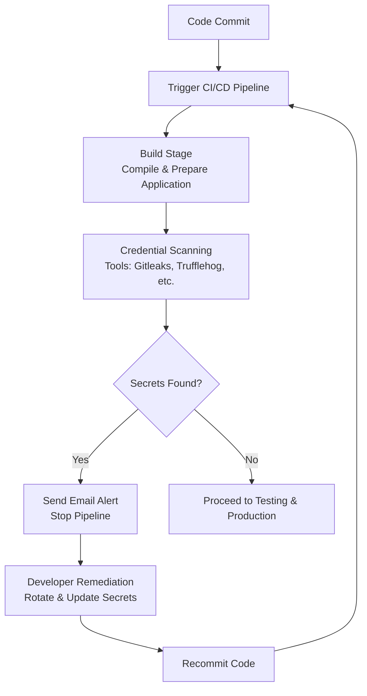

# REACT DAST

---

## Author Information

| **Author**   | **Created on** | **Version** | **Last updated by** | **Last edited on** | **Level** | **Reviewer**  |
|--------------|----------------|-------------|---------------------|--------------------|-----------|---------------|
| Ishaan    | 17-08-25    | v1.0  |  Ishaan  |17-08-25   | Internal    | Rohit Chopra    | 
| Ishaan    |     |   |  Ishaan  |   | L0    |     | 
| Ishaan    |     | v1.0  |  Ishaan  |15-08-25   | L1    |     | 
| Ishaan    |     | v1.0  |  Ishaan  |15-08-25   | L2    |    | 

---

## Table of Contents

1. [Introduction](#1-introduction)  
2. [What is  Credential Scanning?](#2-What-is-Credential-Scanning)  
3. [Why need Credential Scanning?](#3-Why-need-Credential-Scanning)  
4. [Workflow Diagram](#4-workflow-diagram)
5. [Different Tools](5-Different-Tools)  
6. [Advantages](#6-advantages)  
7. [Best Practices](#7-best-practices)  
8. [Conclusion](#8-conclusion)  
9. [FAQs](#9-faqs)  
10. [Contact Information](#10-contact-information)  
11. [References](#11-references)

---

## 1. Introduction

This document explains, and the tools and best practices.

---

## 2. What is  Dynamic Application Security Testing?
Dynamic Application Security Testing (DAST) is a method of testing web applications for security vulnerabilities by simulating real-world attacks on a running application. It analyzes the application from an "outside-in" perspective, much like a malicious hacker would, without needing access to the application's source code.

---

## 3. Why need DAST?

Dynamic Application Security Testing (DAST) is crucial because it identifies real-world vulnerabilities in running applications, which could be exploited by attackers, and it does so without needing access to the source code.

| **Reason**                               | **Explanation**                                                                 |
|------------------------------------------|---------------------------------------------------------------------------------|
| **Simulates real-world attacks**          | DAST tools mimic how attackers interact with a live app, finding vulnerabilities other methods may miss. |
| **Identifies runtime issues**             | Detects vulnerabilities that only appear when the application is running (e.g., session flaws, XSS). |
| **Reduces risk of breaches and data leaks** | Finds vulnerabilities early in SDLC to fix before exploitation, lowering breach and data leak risks. |
| **Verifies security of third-party apps** | Assesses the security of externally built/vendor applications without source code. |
| **Language-independent**                     | Works with apps written in any language since it interacts from the outside.     |

---

## 4. Workflow 

---
## 5. Different Tools

| **Tool**        | **Description** |
|-----------------|-----------------|
| **OWASP ZAP**   | Open-source DAST tool widely used for finding vulnerabilities in web apps and APIs. Supports automation via CLI and Docker. |
| **Burp Suite**  | Powerful security testing tool with manual and automated DAST capabilities. Popular among penetration testers. |
| **StackHawk**   | Developer-focused DAST tool built for CI/CD pipelines, with strong support for APIs, JWT/OAuth, and modern apps. |
| **Invicti (Netsparker)** | Commercial scanner with advanced automation and accurate vulnerability verification for web apps and SPAs. |
| **Acunetix**    | Comprehensive commercial DAST tool that scans web apps, APIs, and complex SPAs with strong reporting features. |
| **Detectify**   | SaaS-based DAST tool leveraging crowd-sourced payloads from ethical hackers to find vulnerabilities. |
| **Probely**     | API-first DAST platform designed for continuous security testing and CI/CD integration. |
| **GitLab DAST** | GitLab-integrated scanner (based on OWASP ZAP) for automated security testing inside GitLab CI/CD pipelines. |

---

## 6. Comparison

| **Tool**        | **License**       | **SPA/JS Support** | **API Testing** | **OAuth/JWT Support** | **CI/CD Integration** | **Ease of Use** |
|-----------------|-------------------|--------------------|-----------------|-----------------------|------------------------|-----------------|
| **OWASP ZAP**   | Open-source (Free) | Yes (AJAX Spider)  | Yes (OpenAPI, SOAP) | Yes (via scripts/Zest, Selenium) | Good (Docker, CLI)     | Moderate (setup/auth config needed) |
| **Burp Suite**  | Commercial (Pro/Enterprise) | Yes | Yes | Yes (manual + extensions) | Good (CLI for Pro, automation in Enterprise) | Moderate to Advanced |
| **StackHawk**   | Commercial (Subscription) | Yes (modern SPAs) | Yes (OpenAPI, GraphQL) | Yes (built-in OIDC/JWT config) | Excellent (built for CI/CD) | Easy (Dev-first approach) |
| **Invicti (Netsparker)** | Commercial | Yes | Yes | Yes (token-based, OAuth2 flows) | Very Good (pipeline plugins, APIs) | Easy (automation-focused) |
| **Acunetix**    | Commercial | Yes | Yes | Yes (OAuth2, JWT, SAML) | Very Good (Jenkins, GitLab, etc.) | Easy (UI-driven, reports) |
| **Detectify**   | SaaS (Commercial) | Yes | Limited (basic API) | Limited (requires token injection) | Very Good (SaaS integrations) | Very Easy (plug-and-scan) |
| **Probely**     | SaaS (Commercial) | Yes | Yes | Yes (OAuth2, JWT, API tokens) | Very Good (API-first, CI hooks) | Easy (automation-friendly) |
| **GitLab DAST** | Open-source (GitLab Premium/Ultimate) | Yes (ZAP-based) | Yes | Yes (via ZAP auth config in CI) | Excellent (native in GitLab CI) | Easy if using GitLab, Moderate otherwise |

---

## 7. Advantages

| **Advantage**                | **Explanation** |
|-------------------------------|-----------------|
| **Real-World Testing**        | Simulates real attacker behavior against the running application, identifying exploitable vulnerabilities. |
| **No Source Code Needed**     | Works as a black-box test, making it useful even when source code is unavailable (e.g., third-party apps). |
| **Detects Runtime Issues**    | Finds vulnerabilities that only appear when the app is live, such as session handling flaws or misconfigurations. |
| **Broad Technology Coverage** | Language-agnostic; works with any application stack (Go, Java, React, Node, etc.) since it tests exposed interfaces. |
| **OWASP Top 10 Coverage**     | Detects common vulnerabilities like SQL Injection, XSS, CSRF, HTML Injection, and authentication flaws. |
| **CI/CD Integration**         | Many tools integrate seamlessly into DevOps pipelines, enabling continuous security testing. |
| **Compliance Support**        | Helps organizations meet industry standards and regulations like PCI-DSS, HIPAA, and GDPR. |
| **Cost-Effective**            | Automated scanning reduces reliance on manual penetration testing, saving time and resources. |
| **Third-Party Validation**    | Can test applications from vendors where internal teams don’t have source code access. |
| **Improves Security Posture** | Provides remediation guidance, helping organizations strengthen overall application security. |

---
## 8. Disadvantages

| **Disadvantage**              | **Explanation** |
|-------------------------------|-----------------|
| **Limited Code Insight**       | Cannot see the source code, so it may miss hidden vulnerabilities not exposed at runtime. |
| **False Positives/Negatives**  | May report issues that don’t exist (false positives) or miss real vulnerabilities (false negatives) depending on configuration and coverage. |
| **Requires Running App**       | Needs a deployed/staging environment to test, unlike SAST which can run on code before deployment. |
| **Authentication Complexity**  | Handling logins, sessions, and OAuth/JWT flows can be tricky and requires extra configuration. |
| **Longer Scan Times**          | Deep scans of large applications can take significant time and resources. |
| **Limited Business Logic Testing** | Struggles with detecting flaws in custom business logic or complex workflows. |
| **Environmental Constraints**  | Can be blocked by WAFs, rate limits, or CAPTCHAs, reducing scan effectiveness. |
| **Cannot Ensure Full Coverage**| Crawlers may miss hidden or unlinked endpoints in Single Page Applications (SPAs) or APIs without specifications. |

---

## 9. POC

---
## 10.  Best Practices

| **Best Practice**                  | **Explanation** |
|-----------------------------------|-----------------|
| **Use a Staging/Test Environment** | Run scans against a non-production environment and seed realistic test data to avoid impacting real users. |
| **Integrate into CI/CD Pipelines** | Automate scans after deployment to staging or nightly builds; include authenticated endpoints. |
| **Handle Authentication Properly** | Configure login scripts, OAuth/JWT tokens, or session management; test with different user roles. |
| **Include API and SPA Coverage**   | Provide OpenAPI/Swagger specs for APIs; ensure JS-heavy SPAs are crawled and rendered properly. |
| **Whitelist Scanner IPs**          | Prevent blocking by WAFs, rate limits, or CAPTCHAs in the test environment. |
| **Start with Baseline, Then Full Scans** | Use quick baseline scans for overview and full scans for in-depth testing of complex endpoints. |
| **Tune and Customize Payloads**    | Adjust payloads for app technology and frameworks; reduce false positives by excluding irrelevant endpoints. |
| **Prioritize Findings**            | Focus on high-severity vulnerabilities (e.g., SQLi, XSS, CSRF) and validate manually if needed. |
| **Maintain Regular Scans**         | Scan after major releases, code changes, or dependency updates; track trends over time. |
| **Combine with Other Security Testing** | Use alongside SAST and SCA to cover code-level and dependency vulnerabilities; DAST finds runtime/exploitable flaws. |

---

## 11. Conclusion

---

## 12. Frequently Asked Questions (FAQs)

### 1. **Do I need to pay for credential scanning tools?**
Many popular tools like **TruffleHog**, **Gitleaks**, and **Detect Secrets** are open-source and free. Some services like **GitGuardian** offer paid plans with additional features.

### 2. **Can credential scanning run automatically?**  
Yes, you can integrate scanners into your **CI/CD pipelines** to scan every commit and pull request automatically.

### 3. **Will credential scanning slow down my CI builds?**  
Minimal impact, but deep Git history scans (like TruffleHog) may take longer depending on repository size.

### 4. **What should I do if a secret is found?**  
Remove it from the codebase, **rotate the secret**, and update configurations to use the new value securely.

### 5. **Does credential scanning guarantee complete protection?**  
No, it reduces risk but should be combined with other security practices like proper secret storage (**Vault**, **AWS Secrets Manager**).

---

## 13. Contact Information

| Name| Email Address      | GitHub | URL |
|-----|--------------------------|-------------|---------|
| Ishaan | ishaan.aggarwal.snaatak@mygurukulam.co|  Ishaan-Dev1  |   https://github.com/Ishaan-Dev1  |

---

## 14. References

| Resource | Link |
|----------|------|
| What is DAST? | [Link](https://www.ibm.com/think/topics/dynamic-application-security-testing) |

