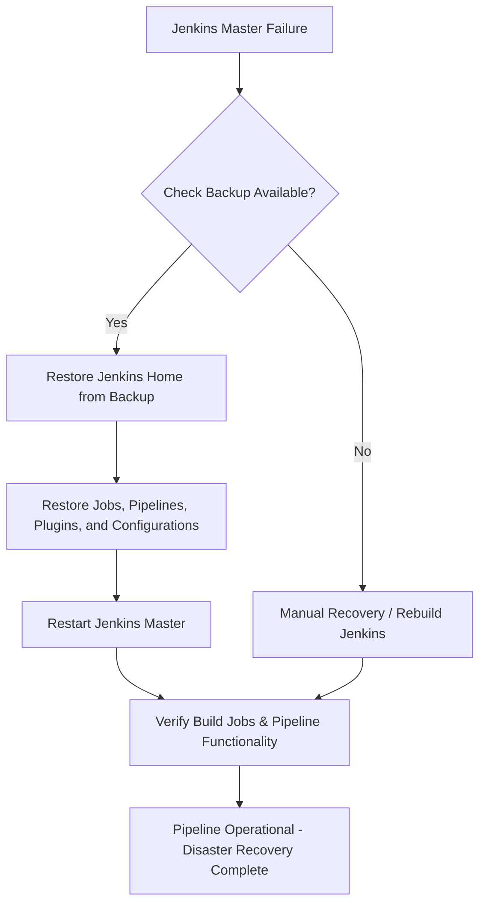

# Jenkins Disaster Recovery

---

### Author Information

| **Author**   | **Created on** | **Version** | **Last updated by** | **Last edited on** | **Level** | **Reviewer**  |
|--------------|----------------|-------------|---------------------|--------------------|-----------|---------------|
| Ishaan    | 13-08-25    | v1.0  |  Ishaan  |13-08-25   | Internal    | Rohit Chopra    | 

---

## Table of Contents

1. [Introduction](#1-introduction)
2. [What is Disaster Recovery?](#2-What-is-Disaster-Recovery?) 
3. [Why we need disaster recovery in Jenkins?](#3-Why-we-need-disaster-recovery-in-Jenkins?)  
4. [Workflow](#5-workflow)
5. [Jenkins Backup, Recovery, and MTTR](#5-jenkins-backup-recovery-and-mttr)
6. [Advantages](#6-advantages)  
7. [Disadvantages](#7-disadvantages)  
8. [Best Practices](#8-best-practices)  
9. [Conclusion](#9-conclusion)
10. [FAQs](#10-FAQs)  
11. [Contact Information](#11-contact-information)  
12. [References](#12-references)

---

## 1. Introduction

This document provides a comprehensive overview of Jenkins Disaster Recovery, including best practices, Mean Time to Recovery (MTTR), workflow diagrams, advantages and disadvantages. 

---
## 2. What is Disaster Recovery?
Disaster recovery (DR) is the process and plan an organization uses to restore its IT infrastructure and operations after a disruption or disaster.
In Jenkins, disaster recovery refers to the processes and strategies employed to restore Jenkins functionality and data after a disruptive event, such as a server failure or data corruption.


---

## 3. Why we need disaster recovery in Jenkins?

Disaster recovery in Jenkins is crucial because a Jenkins master server represents a single point of failure (SPOF) for an organization's Continuous Integration/Continuous Delivery (CI/CD) pipeline. The loss or inaccessibility of the Jenkins master can severely impact the ability to build, test, and release software


 | **Reason**                       | **Explanation**                                                                                  |
|----------------------------------|--------------------------------------------------------------------------------------------------|
| Protect Against Data Loss        | Jenkins stores jobs, pipeline configs, build history, plugins, and credentials. DR prevents losing all this data due to crashes or accidental deletion. |
| Ensure Business Continuity       | If Jenkins fails, builds and deployments stop. DR keeps the pipeline running with minimal downtime. |
| Minimize Downtime                | A good DR plan brings Jenkins back quickly, reducing lost productivity and stalled releases.    |
| Handle Unexpected Failures       | Servers can fail due to hardware, OS, network issues, or human error. DR ensures the pipeline is not affected. |
| Compliance & Audit Requirements  | Logs, build artifacts, and pipeline history may be needed for audits. DR helps preserve them.  |
| Plugin & Configuration Recovery  | Jenkins uses many plugins. DR allows restoring all configs and plugin versions consistently.    |


---

## 4. Workflow 




---
## 5. Jenkins Backup, Recovery, and MTTR

### 1. Backup

#### What to backup
- Entire `JENKINS_HOME` folder (`/var/lib/jenkins`)
  - Jobs (`jobs/`)
  - Build history (`builds/`)
  - Plugins (`plugins/`)
  - Credentials & secrets (`credentials.xml`, `secrets/`)
  - Configurations (`config.xml`)

#### How to backup

| Method                | Description                                         |
|-----------------------|-----------------------------------------------------|
| Cloud/S3              | Use scripts or Jenkins job to sync backups to AWS S3 |
| ThinBackup Plugin     | Plugin-based scheduled backup of jobs and configs   |


#### Frequency
- Nightly or after critical changes


### 2. Recovery

### Steps to restore Jenkins
1. Install Jenkins on a new server
2. Stop Jenkins service:
   ```bash
   sudo systemctl stop jenkins
   ```
3. Restore JENKINS_HOME from backup (local or S3):
   ```bash
     tar -xzf jenkins_backup.tar.gz -C /var/lib/jenkins
     sudo chown -R jenkins:jenkins /var/lib/jenkins
   ```
4. Start Jenkins:
   ```bash
   sudo systemctl start jenkins
   ```

### 3. MTTR (Mean Time to Recovery)
Average time to restore Jenkins after a failure.
#### Factors affecting MTTR
- Backup method (cloud vs local)
- Size of Jenkins data (jobs + build history)
- Automation level (manual restore vs IaC automated restore)

| Backup Method                          | Estimated MTTR      |
|----------------------------------------|-------------------|
| ThinBackup plugin + local restore       | 1–2 hours         |
| Cloud backup (S3) + manual restore     | 1–3 hours         |
| IaC automated restore (Terraform/Ansible) | 15–30 minutes    |
| High Availability (HA) setup           | <5 minutes (failover) |


    
---

## 6. Advantages

| Advantage               | Description |
|-------------------------|------------|
| High Availability       | Jenkins' distributed nature keeps pipelines running even if a node fails. |
| Minimal Downtime        | Quick restoration of Jenkins instances reduces downtime during disasters. |
| Data Protection         | Backup and restore of configurations and jobs preserves critical data. ||
| Reduced Business Impact | DR strategy minimizes delays and disruptions to software delivery. |

---

## 7. Disadvantages

| Disadvantage                 | Description |
|-------------------------------|------------|
| Complexity                    | Setting up DR with backups, cloud, or HA can be technically complex. |
| Storage Requirements          | Backing up full `JENKINS_HOME` can consume large storage space. |
| Partial Recovery Risk         | Some data like running builds or workspace files may be lost. |
| Cost (Optional)               | Cloud storage, extra servers, or HA setup can increase costs. |


---

## 8. Best Practices


| Best Practice                            | Description |
|------------------------------------------|------------|
| Regular Backups                           | Schedule daily or frequent backups of `JENKINS_HOME` including jobs, plugins, configs, and credentials. |
| Offsite Storage                           | Store backups on cloud (S3, GCP, Azure) or a remote server to protect against local failures. |
| Version Control Configurations            | Store Jenkinsfiles, scripts, and pipeline configurations in Git for easy recovery and rollback. |
| Use Plugins Wisely                         | Utilize plugins like ThinBackup or Job Configuration History for automated and incremental backups. |
| Use Infrastructure as Code (IaC) for Jenkins | Automate setup and recovery using Terraform, Ansible, or similar tools. |
| Highly Available Jenkins Setup             | Implement HA with multiple masters or agents to reduce downtime risk. |
| Snapshotting Jenkins Instances             | Take periodic snapshots of Jenkins server or VM to quickly restore to a known state. |

---


## 9. Conclusion


Disaster Recovery in Jenkins is a vital component of any CI/CD strategy, helping organizations quickly recover from failures and maintain uninterrupted software delivery. 
By combining regular backups, cloud storage, automated recovery, and High Availability configurations, teams can safeguard their jobs, pipelines, plugins, and credentials. 
A well-planned DR approach reduces downtime, minimizes data loss, and ensures business continuity, enabling development teams to focus on delivering quality software with confidence.

---

## 10. FAQs


#### 1. What is Jenkins Disaster Recovery?
Jenkins DR is the process of backing up and restoring Jenkins data and configurations to ensure continuous operation in case of failure.

#### 2. What should be backed up for DR in Jenkins?
The entire `JENKINS_HOME` folder, including jobs, plugins, build history, credentials, and configuration files.

#### 3. How often should Jenkins be backed up?
At least nightly, and more frequently if critical jobs are frequently updated.

#### 4. Can Jenkins DR be automated?
Yes, using Infrastructure as Code tools like Terraform or Ansible for provisioning and restoring Jenkins instances.

#### 5. What is MTTR in Jenkins DR?
MTTR (Mean Time to Recovery) is the average time it takes to restore Jenkins to operational status after a failure.

#### 6. How do cloud backups help in Jenkins DR?
Cloud backups (AWS S3, GCP, Azure) provide offsite storage, enabling restoration even if the primary server is completely unavailable.

#### 7. What are common DR strategies for Jenkins?
Regular backups, HA setup, snapshotting instances, automated recovery scripts, and offsite storage.


---

## 11. Contact Information

| Name| Email Address      | GitHub | URL |
|-----|--------------------------|-------------|---------|
| Ishaan | ishaan.aggarwal.snaatak@mygurukulam.co|  Ishaan-Dev1  |   https://github.com/Ishaan-Dev1  |


---

## 12. References

| Source                          | Link                                                                 |
|---------------------------------|----------------------------------------------------------------------|
|Jenkins Backup Documentation | [Link](https://www.jenkins.io/doc/book/system-administration/backing-up/) |
| Disaster Recovery Guide	 | [Link](https://medium.com/clarusway/disaster-recovery-guide-for-jenkins-2-6463e255964d)|
|Best practices for Disaster Recovery |[Link](https://www.geeksforgeeks.org/devops/best-practices-for-disaster-recovery-in-jenkins-and-aws-workflows/#1-regular-backups-of-jenkins-and-configuration)|
