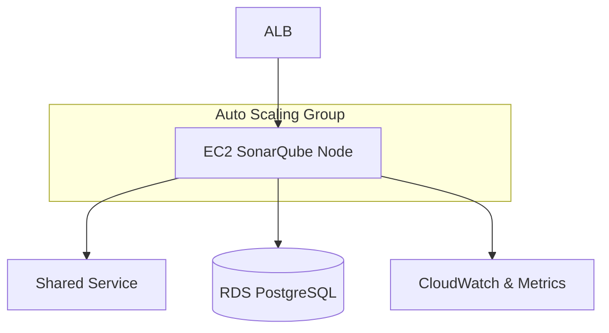

# SonarQube High Availability

---

### Author Information

| **Author**   | **Created on** | **Version** | **Last updated by** | **Last edited on** | **Level** | **Reviewer**  |
|--------------|----------------|-------------|---------------------|--------------------|-----------|---------------|
| Ishaan    | 13-08-25    | v1.0  |  Ishaan  |13-08-25   | Internal    | Rohit Chopra    | 

---

## Table of Contents

1. [Introduction](#1-introduction)
2. [What is SonarQube High Availability?](#2-What-is-SonarQube-High-Availability?) 
3. [Why we need High Availability in SonarQube?](#3-Why-we-need-High-Availability-in-SonarQube?)  
4. [Workflow](#5-workflow)
5. [SonarQube Disaster Recovery and Backup](#5-SonarQube-Disaster-Recovery-and-Backup)
6. [Advantages](#6-advantages)  
7. [Disadvantages](#7-disadvantages)  
8. [Best Practices](#8-best-practices)  
9. [Conclusion](#9-conclusion)
10. [FAQs](#10-FAQs)  
11. [Contact Information](#11-contact-information)  
12. [References](#12-references)

---

## 1. Introduction

This document provides an overview of implementing High Availability (HA) for SonarQube, including its purpose, workflow architecture, advantages, disadvantages, best practices, and disaster recovery considerations

---

## 2. What is SonarQube High Availability?
SonarQube is a widely used open-source platform for continuous inspection of code quality. It helps developers identify bugs, code smells, vulnerabilities, and technical debt across multiple programming languages.
By deploying SonarQube in a clustered architecture with multiple application and search nodes, supported by a load balancer and a highly available database, organizations can maintain continuous code quality checks as part of their CI/CD pipelines.

High Availability refers to the deployment strategy that ensures continuous operation of SonarQube services without significant downtime.

**Note**: High Availibility is available only in SonarQube Server's Data Center Edition.

---

## 3. Why we need High Availability in SonarQube?

| Reason | Description |
|--------|-------------|
| **Minimize Downtime** | Without HA, any SonarQube outage directly impacts CI/CD pipelines, delaying code analysis and releases. HA ensures uninterrupted availability. |
| **Reduced Risk of Data Loss** | While HA doesn't directly prevent data loss, it often incorporates redundancy (e.g., shared storage, replicated databases), improving data resilience and enabling faster recovery after failures. |
| **Ensure Business Continuity** | For organizations with frequent builds, SonarQube downtime interrupts automated quality checks. HA maintains continuous service, avoiding workflow disruptions. |
| **Scalability for Performance** | HA with clustering supports horizontal scaling—adding more nodes to handle larger workloads and improve responsiveness, especially for large codebases or concurrent analyses. |
| **Support for Critical Development Workflows** | SonarQube is central to code quality, security, and compliance checks. HA minimizes risks of delays, ensuring critical workflows proceed without interruption. |
| **Resilience to Failures** | HA architecture prevents single points of failure (SPOF) at the application level, maintaining system stability and reliability. |

---

## 4. Workflow 

---
## 5. SonarQube Disaster Recovery and Backup

| **Method**                           | **Description** |
|--------------------------------------|-----------------|
| Database Backup & Restore            | Regular full and incremental backups of the SonarQube database (PostgreSQL/MySQL) using tools like `pg_dump` or `mysqldump`. |
| Configuration File Backup            | Backup `sonar.properties`,  and other configuration files to a secure version-controlled repository. |
| Plugin Backup                        | Maintain copies of all installed plugins from `$SONARQUBE_HOME/extensions/plugins`. |
| Application Binary Backup            | Keep a copy of SonarQube binaries (same version) for quick redeployment. |

For Detailed SonarQube Disaster Recovery follow [Link]()

    
---

## 6. Advantages

| **Advantage** | **Description** |
|---------------|-----------------|
| **Minimized Downtime** | If one node fails, others take over, ensuring SonarQube remains accessible. |
| **Continuous Code Analysis** | Builds and code scans can proceed without interruption, avoiding CI/CD pipeline delays. |
| **Faster Disaster Recovery** | Failover happens automatically without needing full service restarts or manual intervention. |
| **Support for Large Teams & Projects** | HA ensures that even during heavy usage, response times remain fast and stable. |
| **Compliance & SLAs** | Meets uptime requirements for critical business processes where SonarQube is integral to DevOps pipelines. |

---

## 7. Disadvantages

| **Disadvantage** | **Description** |
|------------------|-----------------|
| **Higher Infrastructure Cost** | Requires multiple servers/nodes, increasing hardware or cloud expenses. |
| **Complex Setup & Configuration** | HA deployment needs load balancers, clustering, and proper network configuration. ||
| **Database Dependency** | Even with HA for the application, the database can still be a single point of failure unless separately clustered. |
| **Version & Edition Limitations** | True HA is only supported in SonarQube Data Center Edition, not in Community  Editions. |

---

## 8. Best Practices

| **Best Practice** | **Description** |
|-------------------|-----------------|
| **Use the Data Center Edition** | Only SonarQube Data Center Edition supports true HA with multiple application and search nodes. |
| **Deploy Multiple Application & Search Nodes** | Separate web/compute nodes from search (Elasticsearch) nodes for performance and fault tolerance. |
| **Implement a Load Balancer** | Use a reverse proxy/load balancer to distribute traffic and handle failover between nodes. |
| **Cluster the Database** | Use a HA database solution  to avoid DB as a single point of failure. |
| **Enable Monitoring & Alerting** | Integrate with tools like Prometheus, Grafana to detect failures quickly. |
| **Plan for Disaster Recovery** | Have backups of database, configuration, and extensions; test restoration regularly. |
| **Keep All Nodes in Sync** | Ensure identical versions, plugins, and configurations across nodes. |
| **Perform Rolling Upgrades** | Upgrade nodes one by one to maintain availability during maintenance. |

---

## 9. Conclusion

High Availability in SonarQube ensures that code quality analysis remains uninterrupted, even during node failures or planned maintenance.
By distributing workloads across multiple application and search nodes, supported by a clustered database and load balancing, organizations can minimize downtime, enhance performance, and improve resilience.

---

## 10. FAQs

#### 1. Is High Availability available in all SonarQube editions?
No. True HA with clustering is available only in the Data Center Edition.

#### 2. Do I need a clustered database for HA?
Yes. A single database instance becomes a single point of failure without clustering or a managed HA database service

#### 3. What are the key components of HA architecture in SonarQube?
Load balancer, multiple application nodes, multiple search nodes, shared storage, and a HA database.

#### 4. How many nodes are recommended for HA SonarQube?
At least two application nodes and three Elasticsearch (search) nodes are recommended for fault tolerance.

---

## 11. Contact Information

| Name| Email Address      | GitHub | URL |
|-----|--------------------------|-------------|---------|
| Ishaan | ishaan.aggarwal.snaatak@mygurukulam.co|  Ishaan-Dev1  |   https://github.com/Ishaan-Dev1  |

---

## 12. References

| Source                          | Link                                                                 |
|---------------------------------|----------------------------------------------------------------------|
|SonarQube DR  Documentation | [Link]() |
| SonarQube Data Center guide	 | [Link](https://docs.sonarsource.com/sonarqube-server/10.8/setup-and-upgrade/install-the-server-as-a-cluster/)|

