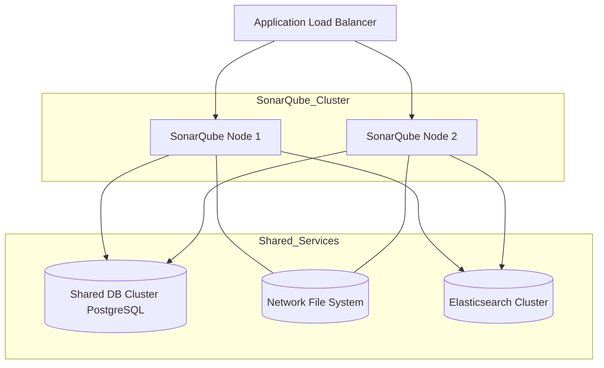

# SonarQube High Availibility

---

### Author Information

| **Author**   | **Created on** | **Version** | **Last updated by** | **Last edited on** | **Level** | **Reviewer**  |
|--------------|----------------|-------------|---------------------|--------------------|-----------|---------------|
| Ishaan    | 13-08-25    | v1.0  |  Ishaan  |13-08-25   | Internal    | Rohit Chopra    | 

---

## Table of Contents

1. [Introduction](#1-introduction)
2. [What is Disaster Recovery?](#2-What-is-Disaster-Recovery?) 
3. [Why we need disaster recovery in Jenkins?](#3-Why-we-need-disaster-recovery-in-Jenkins?)  
4. [Workflow](#5-workflow)
5. [Jenkins Backup, Recovery, and MTTR](#5-jenkins-backup-recovery-and-mttr)
6. [Advantages](#6-advantages)  
7. [Disadvantages](#7-disadvantages)  
8. [Best Practices](#8-best-practices)  
9. [Conclusion](#9-conclusion)
10. [FAQs](#10-FAQs)  
11. [Contact Information](#11-contact-information)  
12. [References](#12-references)

---

## 1. Introduction

This document provides a comprehensive overview of , workflow diagrams, advantages and disadvantages. 

---
## 2. What is SonarQube?
SonarQube is a widely used open-source platform for continuous inspection of code quality. It helps developers identify bugs, code smells, vulnerabilities, and technical debt across multiple programming languages.

High Availability refers to the deployment strategy that ensures continuous operation of SonarQube services without significant downtime.

**Note**: High Availibility is available only in SonarQube Server's Data Center Edition.

---

## 3. Why we need High Availibility in SonarQube?

| Reason | Description |
|--------|-------------|
| **Minimize Downtime** | Without HA, any SonarQube outage directly impacts CI/CD pipelines, delaying code analysis and releases. HA ensures uninterrupted availability. |
| **Reduced Risk of Data Loss** | While HA doesn't directly prevent data loss, it often incorporates redundancy (e.g., shared storage, replicated databases), improving data resilience and enabling faster recovery after failures. |
| **Ensure Business Continuity** | For organizations with frequent builds, SonarQube downtime interrupts automated quality checks. HA maintains continuous service, avoiding workflow disruptions. |
| **Scalability for Performance** | HA with clustering supports horizontal scaling—adding more nodes to handle larger workloads and improve responsiveness, especially for large codebases or concurrent analyses. |
| **Support for Critical Development Workflows** | SonarQube is central to code quality, security, and compliance checks. HA minimizes risks of delays, ensuring critical workflows proceed without interruption. |
| **Resilience to Failures** | HA architecture prevents single points of failure (SPOF) at the application level, maintaining system stability and reliability. |
| **Meeting Business Requirements** | For organizations with strict uptime requirements, HA ensures SonarQube’s capabilities are consistently available to meet business and operational needs. |

---

## 4. Workflow 

---
## 5. SonarQube Disaster Recovery and Backup

| **Method**                           | **Description** |
|--------------------------------------|-----------------|
| Database Backup & Restore            | Regular full and incremental backups of the SonarQube database (PostgreSQL/MySQL) using tools like `pg_dump` or `mysqldump`. |
| Configuration File Backup            | Backup `sonar.properties`, `wrapper.conf`, and other configuration files to a secure version-controlled repository. |
| Plugin Backup                        | Maintain copies of all installed plugins from `$SONARQUBE_HOME/extensions/plugins`. |
| Application Binary Backup            | Keep a copy of SonarQube binaries (same version) for quick redeployment. |

For Detailed SonarQube Disaster Recovery follow [Link]()

    
---

## 6. Advantages

| Advantage               | Description |
|-------------------------|------------|
| High Availability       | Jenkins' distributed nature keeps pipelines running even if a node fails. |
| Minimal Downtime        | Quick restoration of Jenkins instances reduces downtime during disasters. |
| Data Protection         | Backup and restore of configurations and jobs preserves critical data. ||
| Reduced Business Impact | DR strategy minimizes delays and disruptions to software delivery. |

---

## 7. Disadvantages

| Disadvantage                 | Description |
|-------------------------------|------------|
| Complexity                    | Setting up DR with backups, cloud, or HA can be technically complex. |
| Storage Requirements          | Backing up full `JENKINS_HOME` can consume large storage space. |
| Partial Recovery Risk         | Some data like running builds or workspace files may be lost. |
| Cost (Optional)               | Cloud storage, extra servers, or HA setup can increase costs. |

---

## 8. Best Practices

| Best Practice                            | Description |
|------------------------------------------|------------|
| Regular Backups                           | Schedule daily or frequent backups of `JENKINS_HOME` including jobs, plugins, configs, and credentials. |
| Offsite Storage                           | Store backups on cloud (S3, GCP, Azure) or a remote server to protect against local failures. |
| Version Control Configurations            | Store Jenkinsfiles, scripts, and pipeline configurations in Git for easy recovery and rollback. |
| Use Plugins Wisely                         | Utilize plugins like ThinBackup or Job Configuration History for automated and incremental backups. |
| Use Infrastructure as Code (IaC) for Jenkins | Automate setup and recovery using Terraform, Ansible, or similar tools. |
| Highly Available Jenkins Setup             | Implement HA with multiple masters or agents to reduce downtime risk. |
| Snapshotting Jenkins Instances             | Take periodic snapshots of Jenkins server or VM to quickly restore to a known state. |

---

## 9. Conclusion

Disaster Recovery in Jenkins is a vital component of any CI/CD strategy, helping organizations quickly recover from failures and maintain uninterrupted software delivery. 
By combining regular backups, cloud storage, automated recovery, and High Availability configurations, teams can safeguard their jobs, pipelines, plugins, and credentials. 
A well-planned DR approach reduces downtime, minimizes data loss, and ensures business continuity, enabling development teams to focus on delivering quality software with confidence.

---

## 10. FAQs

#### 1. What is Jenkins Disaster Recovery?
Jenkins DR is the process of backing up and restoring Jenkins data and configurations to ensure continuous operation in case of failure.

#### 2. What should be backed up for DR in Jenkins?
The entire `JENKINS_HOME` folder, including jobs, plugins, build history, credentials, and configuration files.

#### 3. How often should Jenkins be backed up?
At least nightly, and more frequently if critical jobs are frequently updated.

#### 4. Can Jenkins DR be automated?
Yes, using Infrastructure as Code tools like Terraform or Ansible for provisioning and restoring Jenkins instances.

#### 5. What is MTTR in Jenkins DR?
MTTR (Mean Time to Recovery) is the average time it takes to restore Jenkins to operational status after a failure.

#### 6. How do cloud backups help in Jenkins DR?
Cloud backups (AWS S3, GCP, Azure) provide offsite storage, enabling restoration even if the primary server is completely unavailable.

#### 7. What are common DR strategies for Jenkins?
Regular backups, HA setup, snapshotting instances, automated recovery scripts, and offsite storage.

---

## 11. Contact Information

| Name| Email Address      | GitHub | URL |
|-----|--------------------------|-------------|---------|
| Ishaan | ishaan.aggarwal.snaatak@mygurukulam.co|  Ishaan-Dev1  |   https://github.com/Ishaan-Dev1  |

---

## 12. References

| Source                          | Link                                                                 |
|---------------------------------|----------------------------------------------------------------------|
|Jenkins Backup Documentation | [Link](https://www.jenkins.io/doc/book/system-administration/backing-up/) |
| Disaster Recovery Guide	 | [Link](https://medium.com/clarusway/disaster-recovery-guide-for-jenkins-2-6463e255964d)|
|Best practices for Disaster Recovery |[Link](https://www.geeksforgeeks.org/devops/best-practices-for-disaster-recovery-in-jenkins-and-aws-workflows/#1-regular-backups-of-jenkins-and-configuration)|
