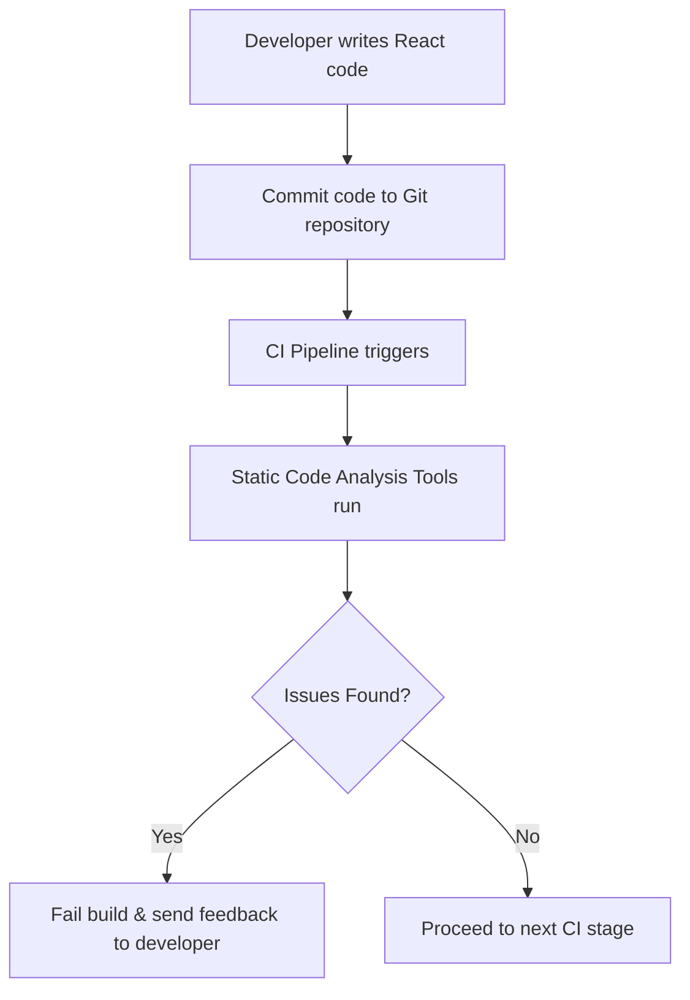

# Python CI Checks – Static Code Analysis

---

### Author Information

| **Author**   | **Created on** | **Version** | **Last updated by** | **Last edited on** | **Level** | **Reviewer**  |
|--------------|----------------|-------------|---------------------|--------------------|-----------|---------------|
| Ishaan    | 15-08-25    | v1.0  |  Ishaan  |15-08-25   | Internal    | Rohit Chopra    | 
| Ishaan    |     |   |  Ishaan  |   | L0    |     | 
| Ishaan    |     | v1.0  |  Ishaan  |15-08-25   | L1    |     | 
| Ishaan    |     | v1.0  |  Ishaan  |15-08-25   | L2    |    | 

---

## Table of Contents

1. [Introduction](#introduction)
2. [What is Static Code Analysis?](#What-is-Static-Code-Analysis?)
3. [Why Use Static Code Analysis in  CI?](#Why-Use-Static-Code-Analysis-in-React-CI?)
4. [Workflow Diagram](#Workflow-Diagram)
5. [Diffrent Tools for  Static Code Analysis](#Diffrent-Tools-for-React-Static-Code-Analysis)
6. [Tool Comparison](#Tool-Comparison)
7. [Advantages](#Advantages)
8. [POC](#POC)
9. [best practices](#best-practices)
10. [Conclusion](#conclusion)
11. [FAQ](#FAQ)
12. [Contact Information](#contact-Information)
13. [References](#references)

---

##  Introduction

This guide explains a straightforward approach to implementing Static Code Analysis in a Python project using SonarQube. It helps automatically detect coding errors, style violations, and potential security issues early in development, ensuring cleaner, more maintainable, and secure code.

---
## What is Static Code Analysis?

Static Code Analysis is the process of examining source code without actually executing it. It relies on automated tools to identify issues such as syntax errors, code smells, potential security vulnerabilities, and violations of coding standards, helping developers improve code quality, maintainability, and security early in the development lifecycle.

---
## Why Use Static Code Analysis ?
| Reason                         | Description                                                  |
| ------------------------------ | ------------------------------------------------------------ |
| **Early Issue Detection**      | Identify problems during development rather than at runtime. |
| **Consistent Code Quality**    | Enforce project-wide style guidelines.                       |
| **Improved Security**          | Catch vulnerabilities before deployment.                     |
| **Faster Reviews**             | Reduce manual review effort.                                 |
| **Reduced Bugs in Production** | Proactively prevent defects.                                 |

---
## Workflow Diagram

---
##  Different Tools for React Static Code Analysis

| Tool       | Definition                                                                 |
| ---------- | -------------------------------------------------------------------------- |
| **Pylint** | Lints Python code to enforce style, detect errors, and improve code quality. |
| **Flake8** | Checks Python code for PEP 8 compliance, syntax errors, and complexity.    |
| **Black**  | Automatically formats Python code for a consistent style.                  |
| **Bandit** | Scans Python code for common security issues and vulnerabilities.          |
| **Mypy**   | Performs static type checking using Python type hints.                      |
| **SonarQube** | Analyzes Python code to detect bugs, vulnerabilities, code smells, and maintainability issues. |

---

##  Tool Comparison
| Criteria               | Pylint | Flake8 | Black | Bandit | Mypy | SonarQube      |
| ---------------------- | ------ | ------ | ----- | ------ | ---- | -------------- |
| Language Support       | Python | Python | Python | Python | Python | Multi-language |
| Code Style Enforcement | Yes    | Yes    | Yes   | No     | No   | Yes            |
| Error Detection        | Yes    | Yes    | No    | No     | Yes  | Yes            |
| Security Scans         | No     | No     | No    | Yes    | No   | Yes            |
| Integration with CI/CD | Yes    | Yes    | Yes   | Yes    | Yes  | Yes            |

---

##  Advantages

| Criteria               | ESLint  | Prettier           | SonarQube      | Stylelint |
| ---------------------- | ------- | ------------------ | -------------- | --------- |
| Language Support       | JS, JSX | JS, JSX, CSS, HTML | Multi-language | CSS, SCSS |
| Code Style Enforcement | Yes     | Yes                | Yes            | Yes       |
| Error Detection        | Yes     | No                 | Yes            | No        |
| Security Scans         | No      | No                 | Yes            | No        |
| Integration with CI/CD | Yes     | Yes                | Yes            | Yes       |

---
## POC -Static Code Analysis for React
_Follow this link for POC_  
(**[Click here to view Setup guide](https://github.com/Snaatak-Apt-Get-Swag/documentation/blob/scrum-152-sunny/Application%20CI%20Design/React%20CI%20Checks/Static%20Code%20Analysis/POC/README.md)**)

---

## Best Practice

| **Best Practice**                | **Description**                                                                             |
| -------------------------------- | ------------------------------------------------------------------------------------------- |
| Use a consistent coding standard | Define and follow a style guide (e.g., Airbnb for JavaScript) to maintain code consistency. |
| Integrate into CI/CD pipeline    | Run static analysis automatically during builds to catch issues early.                      |
| Regularly update analysis tools  | Keep tools like ESLint, SonarQube, or Prettier up-to-date for latest rules and bug fixes.   |
| Address warnings promptly        | Fix reported issues as soon as possible to prevent technical debt accumulation.             |

---
##  Conclusion

Integrating static code analysis into a React CI pipeline ensures that only clean, secure, and maintainable code reaches production. By using tools like ESLint, Prettier, and SonarQube, teams can enforce consistent coding standards, catch issues early, and reduce technical debt, ultimately improving code quality and development efficiency.

---

##  Contact Information

| Name| Email Address      | GitHub | URL |
|-----|--------------------------|-------------|---------|
| Ishaan | ishaan.aggarwal.snaatak@mygurukulam.co|  Ishaan-Dev1  |   https://github.com/Ishaan-Dev1  |

---

##  References

| Resource | Description | Link |
|----------|-------------|------|
| **ESLint Documentation** | Official documentation for ESLint rules, setup, and usage. | [Visit](https://eslint.org/docs/latest/) |
| **Prettier Documentation** | Official guide for Prettier code formatting tool. | [Visit](https://prettier.io/docs/en/) |
| **SonarQube Documentation** | Documentation for SonarQube code quality and security analysis. | [Visit](https://docs.sonarqube.org/latest/) |
| **Stylelint Documentation** | Official documentation for Stylelint CSS/SCSS linter. | [Visit](https://stylelint.io/) |
| **GitHub Actions** | Guide to automate workflows using GitHub Actions. | [Visit](https://docs.github.com/en/actions) |

---
 |
