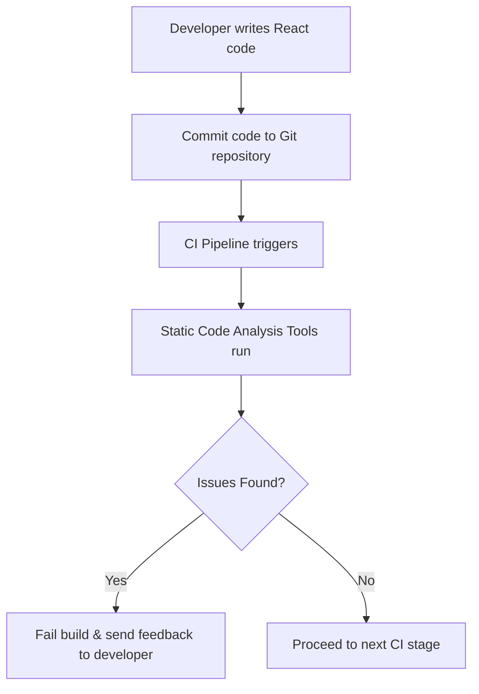

# Python CI Checks – Static Code Analysis

---

### Author Information

| **Author**   | **Created on** | **Version** | **Last updated by** | **Last edited on** | **Level** | **Reviewer**  |
|--------------|----------------|-------------|---------------------|--------------------|-----------|---------------|
| Ishaan    | 15-08-25    | v1.0  |  Ishaan  |15-08-25   | Internal    | Rohit Chopra    | 
| Ishaan    |     |   |  Ishaan  |   | L0    |     | 
| Ishaan    |     | v1.0  |  Ishaan  |15-08-25   | L1    |     | 
| Ishaan    |     | v1.0  |  Ishaan  |15-08-25   | L2    |    | 

---

## Table of Contents

1. [Introduction](#1-introduction)
2. [What is Static Code Analysis?](#2-What-is-Static-Code-Analysis?)
3. [Why Use Static Code Analysis?](#3-Why-Use-Static-Code-Analysis-in-React-CI?)
4. [Workflow Diagram](#4-Workflow-Diagram)
5. [Diffrent Tools for Python Static Code Analysis](#5-Diffrent-Tools-for-Python-Static-Code-Analysis)
6. [Tool Comparison](#6-Tool-Comparison)
7. [Advantages](#7-Advantages)
8. [Disadvantages](#8-disadvantages)
9. [POC](#9-POC-Static-Code-Analysis-for-Python)
10. [best practices](#10-best-practices)
11. [Conclusion](#11-conclusion)
12. [FAQs](#12-fAQs)
13. [Contact Information](#13-contact-Information)
14. [References](#14-references)

---

## 1. Introduction

This guide explains a straightforward approach to implementing Static Code Analysis in a Python project using SonarQube. It helps automatically detect coding errors, style violations, and potential security issues early in development, ensuring cleaner, more maintainable, and secure code.

---
## 2. What is Static Code Analysis?

Static Code Analysis is the process of examining source code without actually executing it. It relies on automated tools to identify issues such as syntax errors, code smells, potential security vulnerabilities, and violations of coding standards, helping developers improve code quality, maintainability, and security early in the development lifecycle.

---
## 3. Why Use Static Code Analysis ?
| Reason                         | Description                                                  |
| ------------------------------ | ------------------------------------------------------------ |
| **Early Issue Detection**      | Identify problems during development rather than at runtime. |
| **Consistent Code Quality**    | Enforce project-wide style guidelines.                       |
| **Improved Security**          | Catch vulnerabilities before deployment.                     |
| **Faster Reviews**             | Reduce manual review effort.                                 |
| **Reduced Bugs in Production** | Proactively prevent defects.                                 |

---
## 4. Workflow Diagram

---
## 5. Different Tools for Python Static Code Analysis

| Tool       | Definition                                                                 |
| ---------- | -------------------------------------------------------------------------- |
| **Pylint** | Lints Python code to enforce style, detect errors, and improve code quality. |
| **Flake8** | Checks Python code for PEP 8 compliance, syntax errors, and complexity.    |
| **Black**  | Automatically formats Python code for a consistent style.                  |
| **Bandit** | Scans Python code for common security issues and vulnerabilities.          |
| **Mypy**   | Performs static type checking using Python type hints.                      |
| **SonarQube** | Analyzes Python code to detect bugs, vulnerabilities, code smells, and maintainability issues. |

---

## 6. Tool Comparison

| Criteria               | Pylint | Flake8 | Black | Bandit | Mypy | SonarQube      |
| ---------------------- | ------ | ------ | ----- | ------ | ---- | -------------- |
| Language Support       | Python | Python | Python | Python | Python | Multi-language |
| Code Style Enforcement | Yes    | Yes    | Yes   | No     | No   | Yes            |
| Error Detection        | Yes    | Yes    | No    | No     | Yes  | Yes            |
| Security Scans         | No     | No     | No    | Yes    | No   | Yes            |
| Integration with CI/CD | Yes    | Yes    | Yes   | Yes    | Yes  | Yes            |

---

## 7. Advantages

| Benefit                           | Description |
| --------------------------------- | ----------- |
| **Early Bug Detection**           | Identifies potential bugs, errors, and vulnerabilities in the code before execution, reducing the cost and effort of fixing issues later in the development cycle. |
| **Improved Code Quality and Reliability** | Enforces coding standards, promotes consistent style, and identifies potential anti-patterns, leading to cleaner, more readable, and maintainable code. |
| **Enhanced Security**             | Detects common security vulnerabilities like SQL injection, cross-site scripting (XSS), insecure API usage, and hard-coded credentials, helping to prevent security breaches. |
| **Automated Code Review and Efficiency** | Automates aspects of code review, providing immediate feedback to developers and accelerating development by catching issues earlier than manual reviews, reducing the need for extensive dynamic testing and debugging. |
| **Compliance and Standards Adherence** | Ensures that the codebase adheres to industry standards, internal coding guidelines, and regulatory requirements, crucial in regulated industries. |
| **Scalability**                    | Can be easily integrated into CI/CD pipelines and applied consistently across large codebases. |

---

## 8. Disadvantages

| Disadvantage                      | Description |
| --------------------------------- | ----------- |
| **Limited Runtime Context**       | These tools analyze code without executing it, so they cannot catch certain runtime errors, environment-specific bugs, or integration issues. |
| **Performance Overhead in Large Projects** | Analyzing large Python codebases can be slow and may require significant computing resources. |
| **Initial Setup and Configuration Effort** | Tools like SonarQube or Pylint require configuration to match project needs, which can be time-consuming for beginners. |

---

## 9. POC Static Code Analysis for Python
_Follow this link for POC_  
(**[Click here to view Setup guide]()**)

---

## 10. Best Practices

| **Best Practice**                | **Description**                                                                                           |
| -------------------------------- | --------------------------------------------------------------------------------------------------------- |
| Use a consistent coding standard | Define and follow a style guide (e.g., PEP 8) to maintain readability and consistency in Python code.     |
| Run analysis before committing   | Execute static analysis locally (e.g., Pylint, Flake8, Black, Bandit) before committing code to catch issues early. |
| Regularly update analysis tools  | Keep tools like Pylint, Flake8, Bandit, Mypy, or SonarQube updated for latest rules, security checks, and bug fixes. |
| Address warnings promptly        | Fix reported issues as soon as possible to prevent technical debt accumulation and maintain code quality. |

---
## 11. Conclusion

Integrating static code analysis into a React CI pipeline ensures that only clean, secure, and maintainable code reaches production. By using tools like ESLint, Prettier, and SonarQube, teams can enforce consistent coding standards, catch issues early, and reduce technical debt, ultimately improving code quality and development efficiency.

---
## 12. FAQs

---

## 13. Contact Information

| Name| Email Address      | GitHub | URL |
|-----|--------------------------|-------------|---------|
| Ishaan | ishaan.aggarwal.snaatak@mygurukulam.co|  Ishaan-Dev1  |   https://github.com/Ishaan-Dev1  |

---

## 14. References

| Resource | Description | Link |
|----------|-------------|------|
| **Different tools for python static code analysis** |[Link](https://blog.codacy.com/python-static-analysis-tools)|
| **SonarQube Documentation** | Documentation for SonarQube code quality and security analysis. | [Link](https://docs.sonarqube.org/latest/) |

---
 |
