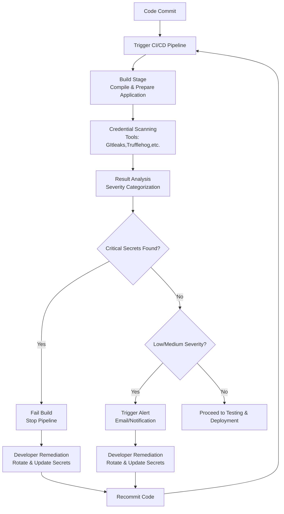

# Cred Scanning

---

### Author Information

| **Author**   | **Created on** | **Version** | **Last updated by** | **Last edited on** | **Level** | **Reviewer**  |
|--------------|----------------|-------------|---------------------|--------------------|-----------|---------------|
| Ishaan    | 11-08-25    | v1.0  |  Ishaan  |12-08-25   | Internal    | Rohit Chopra    | 

---

## Table of Contents

1. [Introduction](#1-introduction)  
2. [What is  Credential Scanning?](#2-What-is-Credential-Scanning)  
3. [Why need Credential Scanning?](#3-Why-need-Credential-Scanning)  
4. [Workflow Diagram](#4-workflow-diagram)
5. [Different Tools](5-Different-Tools)  
6. [Advantages](#6-advantages)  
7. [Best Practices](#7-best-practices)  
8. [Conclusion](#8-conclusion)  
9. [FAQs](#9-faqs)  
10. [Contact Information](#10-contact-information)  
11. [References](#11-references)

---

## 1. Introduction

This document explains credential scanning — the process of detecting and preventing hardcoded secrets like API keys, passwords, and tokens in codebases. It covers how credential scanning works, why it’s important for security, and the tools and best practices.

---

## 2. What is  Credential Scanning?

Credential scanning in continuous integration (CI) involves automatically inspecting code and configuration files for hardcoded secrets, such as passwords, API keys, and other sensitive information, to prevent them from being exposed in production environments

---

## 3. Why need Credential Scanning?

| Benefit | Description |
|---------|-------------|
| **Prevent Data Breaches** | Secrets like API keys, database passwords, and access tokens can grant attackers unauthorized access if exposed. Credential scanning identifies and removes them before exploitation. |
| **Reduces the Attack Surface** | Minimizing exposed secrets lowers the potential entry points for malicious actors. |
| **Early Detection** | Stops secrets from leaving the developer's local environment. |
| **Automates Security Checks** | Integrates into CI pipelines to ensure consistent and regular scanning for vulnerabilities. |
| **Improves Security Posture** | Proactively addresses secret exposures to build secure applications and infrastructure. |
| **Compliance** | Supports adherence to security standards like GDPR, HIPAA, and PCI-DSS. |

---

## 4. Workflow Diagram

---
## 5. Different Tools

| Tool | Description | Key Features | Integrations | Pricing |
|------|-------------|--------------|--------------|---------|
| **TruffleHog** | Scans for high entropy strings and secrets in code, Git history, cloud storage, and Docker images. | Regex + entropy detection, deep history scan, multi-source scanning | GitHub, GitLab, Bitbucket, S3, local FS, Docker | Open-source |
| **Gitleaks** | Lightweight secret scanner for Git repos. | Fast, customizable regex rules, history scanning | GitHub Actions, GitLab CI, Jenkins | Open-source |
| **GitHub Secret Scanning** | Native GitHub feature for private/public repos. | Real-time scanning, partner patterns | GitHub only | Built-in for Enterprise |
| **Detect Secrets** | Yelp’s Python-based secret scanner. | Baseline file, plugin-based detection | CI/CD pipelines, pre-commit | Open-source |
| **GitGuardian** | SaaS secret detection & monitoring. | Dashboard, real-time alerts, remediation help | GitHub, GitLab, Bitbucket | Paid with free tier |

---

## 5. Advantages

| Advantage                    | Description                                                                 |
|-----------------------------|-----------------------------------------------------------------------------|
| Early Detection             | Catches exposed secrets before they reach production or public repos.       |
| Automated Enforcement       | Scans every commit/build automatically—no manual effort needed.             |
| Developer Feedback Loop     | Alerts developers instantly during CI runs for quick remediation.           |
| Reduced Breach Risk         | Prevents leaks of sensitive data like API keys, tokens, and passwords.      |
| Easy CI Integration         | Works smoothly with CI tools like GitHub Actions, GitLab CI, and Jenkins.   |
---

## 6.  Best Practices

| Best Practice                          | Why It Works Across All Tools                                              |
|----------------------------------------|----------------------------------------------------------------------------|
| **Automate Scanning in CI/CD**         | All tools support CLI or CI integration—ensures secrets are caught early. |
| **Use Pre-Commit Hooks**               | Tools like Detect Secrets and Gitleaks support this—prevents secrets before commit. |
| **Maintain a Baseline File**           | Helps track known secrets and reduce noise—supported by Detect Secrets, Gitleaks. |
| **Regularly Update Detection Rules**   | Keeps regex and entropy logic current—most tools allow custom rule sets.  |
| **Scan Git History Periodically**      | Deep scans catch secrets in older commits—TruffleHog and Gitleaks excel here. |
| **Avoid Logging Secrets in CI Output** | Prevents accidental exposure—applies to all CI environments and scanners.  |

---

## 8. Conclusion

Credential scanning is an essential practice to safeguard applications and infrastructure from accidental secret leaks.
We chose Gitleaks as our primary credential scanning tool because it is lightweight, fast, easy to integrate with Jenkins, customizable with regex patterns, capable of scanning Git history, and actively maintained as an open-source project, ensuring early detection of secrets to strengthen our security posture.

---

## 9. Frequently Asked Questions (FAQs)

### 1. **Do I need to pay for credential scanning tools?**
Many popular tools like **TruffleHog**, **Gitleaks**, and **Detect Secrets** are open-source and free. Some services like **GitGuardian** offer paid plans with additional features.

### 2. **Can credential scanning run automatically?**  
Yes, you can integrate scanners into your **CI/CD pipelines** to scan every commit and pull request automatically.

### 3. **Will credential scanning slow down my CI builds?**  
Minimal impact, but deep Git history scans (like TruffleHog) may take longer depending on repository size.

### 4. **What should I do if a secret is found?**  
Remove it from the codebase, **rotate the secret**, and update configurations to use the new value securely.

### 5. **Does credential scanning guarantee complete protection?**  
No, it reduces risk but should be combined with other security practices like proper secret storage (**Vault**, **AWS Secrets Manager**).

---

## 10. Contact Information

| Name| Email Address      | GitHub | URL |
|-----|--------------------------|-------------|---------|
| Ishaan | ishaan.aggarwal.snaatak@mygurukulam.co|  Ishaan-Dev1  |   https://github.com/Ishaan-Dev1  |

---

## 11. References

| Resource | Link |
|----------|------|
| TruffleHog Documentation | [Link](https://github.com/trufflesecurity/trufflehog) |
| Gitleaks Documentation | [Link](https://github.com/gitleaks/gitleaks) |
| GitHub Secret Scanning Docs | [Link](https://docs.github.com/en/code-security/secret-scanning) |
| Detect Secrets Documentation | [Link](https://github.com/Yelp/detect-secrets) |
| GitGuardian Documentation | [Link](https://www.gitguardian.com) |
