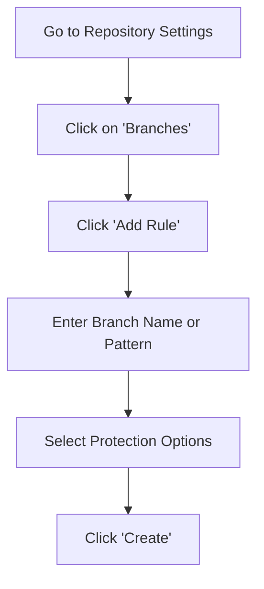

# Branch Access Policies Documentation

---

### Author Information

| **Author**   | **Created on** | **Version** | **Last updated by** | **Last edited on** | **Level** | **Reviewer**  |
|--------------|----------------|-------------|---------------------|--------------------|-----------|---------------|
| Ishaan    | 31-07-25    | v1.0  |  Ishaan  |31-07-25   | Internal    | Rohit Chopra    | 

---

## Table of Contents

1. [Introduction](#1-introduction)
2. [What are Branch Access Policies?](#2-what-are-branch-access-policies) 
3. [Why Branch Access Policies ](#3-why-branch-access-policies)  
4. [Branch Protection Rules](#4-branch-protection-rules)  
5. [Workflow](#5-workflow)
6. [Advantages](#6-advantages)  
7. [Disadvantages](#7-disadvantages)  
8. [Best Practices](#8-best-practices)  
9. [Conclusion](#9-conclusion)
10. [FAQs](#10-FAQs)  
11. [Contact Information](#11-contact-information)  
12. [References](#12-references)

---

## 1. Introduction

Branch access policies in GitHub, often referred to as branch protection rules or rulesets, are a set of configurations that repository administrators can implement to control how changes are made to specific branches within a repository.

---
## 2. What are Branch Access Policies 

Branch Access Policy is a set of rules that control who can make changes to specific branches in a GitHub repository and how those changes can be made.

Git branch protection rules are a powerful configuration option that enables repository administrators to enforce security policies. This helps protect the git branches from unexpected code commits or deletion by any unauthorized person(s) / user group(s).
Unrestricted branch access can lead to unreviewed code, broken builds, or security issues.

---

## 3. Why Branch Access Policies 

**Branch access policies help:**

- Avoid unnecessary code commits to the branch
- Enforce code reviews before merging the code to the branch
- Maintain a healthy codebase without affecting collaboration
- Maintain a commit history (by disallowing force pushes)
- Prevent code from leaking into your public repositories 

---

## 4. Branch Protection Rules

| Rule                            | Description                                                                 |
|----------------------------------|-----------------------------------------------------------------------------|
| **Require a pull request before merging**|      Prevents direct pushes — changes must go through a pull request.           |
| **Require status checks to pass before merging**      |     Ensures automated checks (like CI tests) pass before merging.                                      |
| **Require conversation resolution before merging**             |    All review comments and discussions must be resolved before merging.            |
| **Require signed commits**      |    Only commits with verified digital signatures are allowed.                 |
| **Require linear history**        |                           	Enforces a clean commit history — no merge commits |
| **Require deployments to succeed before merging**          |     	Code can only be merged if deployment to an environment is successful.  |   
|    **Lock branch**   |             Branch is read-only. Users cannot push to the branch    |

---

## 5. Workflow 

## 6. Advantages

| Advantage                               | Description                                                                 |
|-----------------------------------------|-----------------------------------------------------------------------------|
| Improved Code Quality                   | Enforces code reviews before merging.                  |
| Clean Git History                       | Disables force-pushes to maintain a linear commit history      |
| Stronger Security                       | Prevents unauthorized changes to sensitive branches.                        |
| Role-Based Control                      | Grants access based on developer roles (read, write, admin).                |

---

## 7. Disadvantages

| Disadvantage                          | Description                                                                 |
|--------------------------------------|-----------------------------------------------------------------------------|
| Slower Development Cycle             | Requires reviews and checks before merging, which can delay progress.       |
| Learning Curve                | New developers may struggle to understand the enforced workflow.            |
| Rule Conflicts            | Incorrect rules or permissions can unintentionally block valid work.        |
| Delayed Delivery | Strict rules can slow down urgent fixes or feature releases. |

---

## 8. Best Practices

| Best Practice                    | Description                                                              |
|----------------------------------|--------------------------------------------------------------------------|
| **Protect Key Branches**         | Apply strict rules to `main`, `release`, and `production` branches.      |
| **Enforce Reviews**              | Require at least 1–2 reviewers for every pull request.                   |
| **Use Status Checks**            | Integrate CI/CD pipelines to run automated tests.                        |
| **Disallow Deletions**        | Prevent accidental or unauthorized deletion of critical branches.               |

---

## 9. Conclusion

Branch access policies are essential for maintaining a secure, high-quality, and collaborative development environment. 
**Recommended Practice:** Protect the `main` and `release` branches with enforced PR reviews, CI status checks, and restricted write access for all team projects.

---

## 10. FAQs

#### 1. Are branch protection rules mandatory?
No, they are not mandatory by default. However, they are highly recommended in collaborative projects to enforce best practices and reduce risks.

#### 2. Can admins bypass protection rules?
Yes, admins with the right permissions can bypass protection rules. However, it's recommended to use this privilege cautiously to maintain workflow integrity.

#### 3. What does commit signing mean?
Commit signing means attaching a digital signature to verify the authenticity of a commit’s author. It helps prevent spoofing and ensures trust.

#### 4. What happens if protection rules are misconfigured?
Misconfiguration may unintentionally block valid contributions or allow insecure changes. It’s important to plan and test the rules before enforcing them.

#### 5. How to apply rules to multiple branches?
You can use wildcard patterns (like `release/*` or `feature/*`) when specifying branch names in protection rules to apply them to multiple branches.

---

## 11. Contact Information

| Name| Email Address      | GitHub | URL |
|-----|--------------------------|-------------|---------|
| Ishaan | ishaan.aggarwal.snaatak@mygurukulam.co|  Ishaan-Dev1  |   https://github.com/Ishaan-Dev1  |

---

## 12. References

| Source                          | Link                                                                 |
|---------------------------------|----------------------------------------------------------------------|
| Setup git protection rules | [Link](https://spectralops.io/blog/how-to-set-up-git-branch-protection-rules/) |
| Branch Protection Best Practices | [Link](https://dev.to/n3wt0n/best-practices-for-branch-protection-2pe3)|

